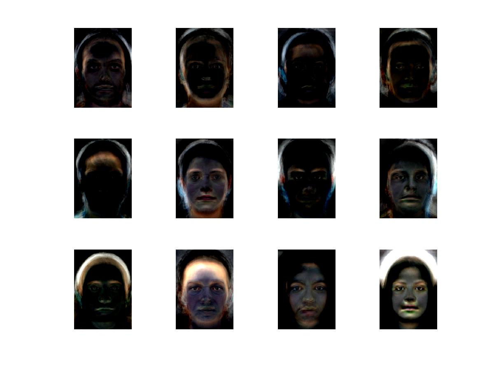
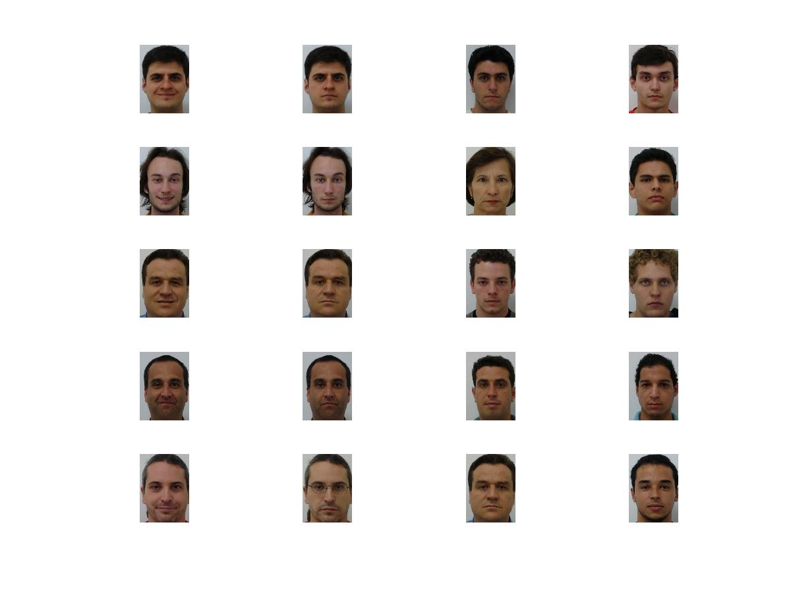

# FaceRecognition

A PCA based Face retrival system that made to work on a data base 100 people (50 males and 50 females).
Use 12 PCA eigenfaces as features for nearest neighbour search during the testing procedure.

Below is the set of 12 eigenfaces used

It was tested on a set of 10 individuals and achives a 100% accuracy on the testing base.

For nearest neighbour search various distance metrics like the euclidean distance, mahalanobis distance, city block distance have been used.

Below shows results of test, nearest three faces observed for each image on left. As you can see the image checked is different in comparision to old face

